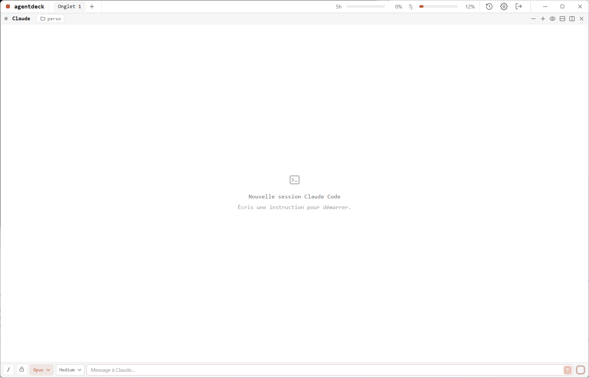

# agentdeck


[](../../releases)

Application desktop (Tauri + Rust + Svelte 5) pour piloter **plusieurs IA en parallèle**.
Premier provider : **Claude Code** (sessions CLI orchestrées). L'architecture est multi-IA :
d'autres providers se branchent en implémentant le trait `Provider` côté Rust, sans toucher au frontend.



## Fonctionnalités

- **Panneaux splittables** (tiling récursif, axe X ou Y) — chaque pane = une session Claude Code indépendante.
- **Connexion à la première ouverture**, deux voies :
  1. *Se connecter à Anthropic* — lance `claude setup-token` (OAuth navigateur).
  2. *Importer le token* — lit `claude-token.txt` du dossier Téléchargements (ou collage manuel).
  - Token stocké **chiffré** dans le gestionnaire d'identifiants Windows (`keyring`), jamais en clair.
- **Usage 5h / 7j** : barres minimalistes + pourcentage.
  - ⚠️ Aucune API publique n'expose les vrais % d'abonnement (`/usage` est interactif). On affiche donc un
    **comptage local** des tokens consommés via l'app, sur fenêtres glissantes (libellé « estimé »).
- **Thème clair / sombre** façon Claude Code, qui suit le système (toggle système/clair/sombre).
- **Sessions persistées** : à la réouverture de l'app, on retrouve ses Claudes (reprise via `claude --resume`).
- **Choix du modèle par chat** : liste récupérée dynamiquement via l'API Models (gratuite) du compte
  (Opus, Sonnet, Haiku, Fable… versionnés), repli sur une liste de secours si hors-ligne.
- **Mode Auto** : un appel léger (Haiku) choisit le modèle et/ou l'effort adapté à chaque demande —
  en tenant compte des **prix** et de la **récence** des modèles pour optimiser le coût sans sacrifier
  la qualité. Le prompt de sélection est consultable dans les Paramètres.
- **Veille des chats** : un chat inactif se met en veille (process `claude` arrêté → RAM libérée),
  réveil au clic ; délai réglable, ou veille manuelle par bouton.
- **Chargement progressif** (historique, catalogues skills/MCP, listes installées) avec petit loader.
- **Gate connexion** : au lancement, si pas d'internet → écran dédié + reconnexion auto.
- **Tour guidé** au premier lancement (rejouable depuis les Paramètres).
- **Mode Hermes** : l'agent capitalise ses erreurs en skills (global ou projet).

## Prérequis (utilisation)

- [Claude Code CLI](https://code.claude.com) installé et dans le `PATH` (`claude --version`).
- Un abonnement **Claude** (Pro/Max) ou un token OAuth Claude Code valide — agentdeck pilote
  *ta* session Claude, il ne fournit pas l'accès à l'IA.
- Windows 10/11 (les builds macOS/Linux arriveront ensuite).

## Installation

Télécharge le dernier installeur sur la page **[Releases](../../releases)** :

- `agentdeck_x.y.z_x64-setup.exe` (installeur NSIS, recommandé), ou
- `agentdeck_x.y.z_x64_en-US.msi`.

> ⚠️ L'app n'est pas encore signée : Windows SmartScreen peut afficher « éditeur inconnu » →
> *Informations complémentaires* → *Exécuter quand même*.

## Développement

Prérequis dev supplémentaires : Node.js + Rust (toolchain stable).


```bash
npm install
npm run tauri dev
```

## Build

```bash
npm run tauri build
```

## Release (mainteneur)

L'auto-update consomme `latest.json` publié sur les GitHub Releases. Pour publier :

1. Garde la clé de signature privée hors du repo (générée via `npm run tauri signer generate`).
   Mets son contenu + son mot de passe dans les secrets GitHub Actions
   `TAURI_SIGNING_PRIVATE_KEY` / `TAURI_SIGNING_PRIVATE_KEY_PASSWORD`.
2. Bump la version (`package.json`, `tauri.conf.json`, `Cargo.toml`) + MAJ `CHANGELOG.md`.
3. `git tag vX.Y.Z && git push --tags` → le workflow `.github/workflows/release.yml` build,
   signe, crée la Release et publie installeurs + `latest.json`.

Build local manuel : `npm run tauri build` (artefacts dans `src-tauri/target/release/bundle/`).

## Architecture

```
src-tauri/src/
  auth.rs                 token OAuth <-> keyring (Windows Credential Manager)
  provider/mod.rs         trait Provider (multi-IA) + TurnConfig
  provider/claude_code.rs adapter Claude Code : spawn `claude`, parse NDJSON -> events
  session.rs              SessionManager (UUID = --session-id / --resume)
  usage.rs                comptage local 5h / 7j
  events.rs               events normalisés (session://{id})
src/
  lib/stores/             theme, auth, usage, sessions, layout (tiling), persist
  lib/components/         Onboarding, ChatPane, SplitContainer, UsageBars, ThemeToggle
```

Chaque tour de conversation lance `claude -p <prompt> --output-format stream-json --verbose
--include-partial-messages` (1er tour : `--session-id <uuid>` ; suivants : `--resume <uuid>`),
avec `CLAUDE_CODE_OAUTH_TOKEN` injecté en environnement.

## Confidentialité

- **Aucune télémétrie** : agentdeck n'envoie rien à un serveur tiers. Les seuls appels réseau
  sortants sont ceux du CLI Claude Code (vers Anthropic) et la lecture de l'usage d'abonnement
  via l'endpoint OAuth d'Anthropic.
- **Token** : stocké chiffré dans le gestionnaire d'identifiants de l'OS, jamais en clair sur disque.
- **Mode Hermes** : s'il est activé, l'agent peut **créer/modifier des fichiers skills** dans
  `~/.claude/skills/` (global) ou `.claude/skills/` (projet) pour capitaliser ses apprentissages.
  Désactive-le si tu ne veux pas que des fichiers soient écrits hors du dossier de travail.
- **Permissions des agents** : par défaut les sessions tournent en `bypassPermissions` (mode
  headless) — l'agent exécute ses outils (édition, shell…) **sans confirmation**. C'est
  nécessaire au pilotage non-interactif. Restreins-le par session via les **règles d'outils**
  (`allowedTools` / `disallowedTools`) ou choisis un autre mode de permission. Ne fais tourner
  que des prompts de confiance.

> Journaux : un fichier de log est écrit dans le dossier de logs de l'app (utile pour signaler
> un bug). Aucune donnée n'en sort de ta machine.

## Avertissement

Projet **non affilié à Anthropic**. *Claude* et *Claude Code* sont des marques d'Anthropic ;
agentdeck est un client tiers indépendant qui s'appuie sur le CLI Claude Code sous l'abonnement
de l'utilisateur. Aucun token n'est transmis à un tiers — il est stocké chiffré dans le
gestionnaire d'identifiants de l'OS.

## Licence

[PolyForm Noncommercial 1.0.0](LICENSE) © 2026 Florent Leterme.
Usage personnel et non-commercial libre ; la revente / l'usage commercial nécessitent une
licence séparée.
